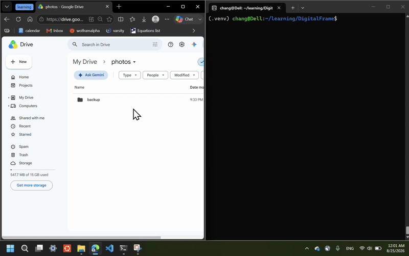
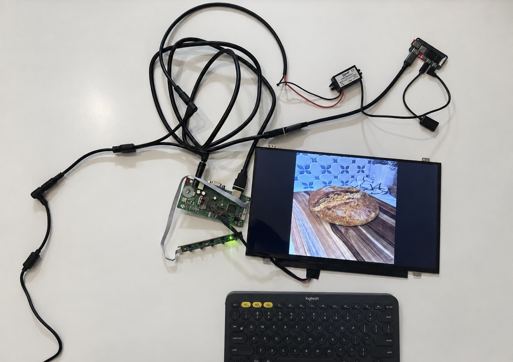

# DigitalFrame

DigitalFrame is a prototype for a self-updating digital photo frame. The Linux client securely connects to a third-party cloud storage provider, synchronizes images to a local cache, and displays them as a continuous slideshow.

## Motivation

This project began as a way to privately share family photos with relatives in China. Existing digital frames and cloud services did not fully meet our needs because of regional internet compatibility and privacy concerns. DigitalFrame explores a homemade alternative that can securely retrieve photos from cloud storage without requiring the recipient to manage uploads, accounts, or downloads.

A future version will run on a Raspberry Pi-style single-board computer connected to a portable display, turning the prototype into a standalone digital frame.

Although the application is intentionally simple, it also provides an opportunity to practice production-oriented software engineering skills, including client-server architecture, API development, cloud authentication, automated testing, containerization, and CI/CD. Development tasks are organized as GitHub issues, implemented on dedicated feature branches, and submitted through pull requests—even when I am both the author and reviewer—to practice a structured development and review workflow.

## Demo





## Project Goals

The DigitalFrame client is designed to:

- Connect to a configured cloud storage provider
- Retrieve available image files
- Download new or updated images to a local cache
- Remove local images that are no longer available remotely
- Periodically check for cloud updates in the background
- Display cached images as a continuous slideshow
- Run on a Raspberry Pi, Banana Pi, or similar Linux device

## Current Features

- Alibaba Cloud OSS authentication using RAM access-key credentials kept in an ignored secrets file
- Remote photo listing and downloading
- Background synchronization at a configurable interval, with cached playback available during network outages
- Newly downloaded photos play next after the current photo finishes, without renaming files
- One-level photo albums mirrored in the local cache, with alternate folder and multi-month selectors
- OSS metadata plus local SHA-256 checks detect additions, edits, moves, renames, deletions, and cache corruption
- Temporary download files to prevent incomplete images from being displayed
- Continuous fullscreen slideshow using a single MPV process controlled through JSON IPC
- Configurable image display duration through `DISPLAY_SECONDS` and a plain HTML control panel on the local Wi-Fi
- HEIC/HEIF iPhone photos converted once during sync to same-stem JPEG derivatives
- One proportional 1600×900 cache limit for HEIC/HEIF, JPEG, PNG, and WebP images
- Automatic EXIF orientation correction whenever an image is converted or reduced
- Fullscreen display at the current screen resolution, with proportional photo scaling and centered black bars
- Graceful handling of missing or invalid cached images
- Waiting screen when no cached photos are available

## Important Limitations

- Only photos directly inside immediate child folders of the configured OSS prefix are included. Loose and deeper nested objects are ignored.
- A process lock permits one sync per cache directory. Album photos in that directory are disposable copies of OSS; a successful sync removes album photos absent from OSS. Legacy loose root photos and unrelated non-photo files are left in place.
- The project is currently a prototype and has not undergone a complete security review.
- A slow MPV image decode can extend a photo interval because timing starts only after MPV reports that the next file loaded successfully.

## Potential Upgrades

- Randomized slideshow order
- Collage layouts
- Encrypted local storage
- Improved authentication and security protocols
- Configurable overwrite and duplicate-handling policies
- User-configurable cloud provider or server URL

## Development Progress

### Phase 1 - Local FastAPI Prototype ([release/1.x](https://github.com/cxu47/DigitalFrame/tree/release/1.x))

- [x] Create the server and client project structure
- [x] Add Docker configuration
- [x] Create a photo-upload endpoint
- [x] Create a photo-listing endpoint
- [x] Download files using a temporary extension until completion
- [x] Continuously check the local cache for displayable photos
- [x] Periodically synchronize the cache in a background thread
- [x] Display cached photos as a slideshow

### Phase 2 - Google Drive Integration

- [x] Configure Google Drive OAuth credentials and tokens
- [x] Retrieve and process the remote file listing
- [x] Download photos from Google Drive
- [x] Filter out folders and unsupported file types
- [x] Add HEIC and other iPhone image-format support
- [x] Reconcile remote deletions with the local cache

### Phase 3 - Alibaba Cloud OSS Integration (`release/3.x`)

- [x] Evaluate Alibaba Cloud OSS compatibility
- [x] Configure RAM access-key authentication from an ignored secrets file
- [x] Confine listing and downloads to a configurable `photos/` prefix
- [x] Implement paginated OSS photo listing and streaming downloads
- [ ] Test connectivity from both the United States and China

### Phase 4 - Hardware Deployment

- [x] Deploy the client on a Raspberry Pi-style device
- [x] Connect and configure a portable display
- [ ] Configure automatic startup after reboot
- [ ] Test unattended synchronization and recovery
- [ ] Assemble the components into a standalone frame enclosure

## Project Status

DigitalFrame is under active development. The current implementation demonstrates the core workflow of authenticating with cloud storage, synchronizing photos into a local cache, and displaying them as a continuously updating slideshow.

### Installation and configuration

DigitalFrame runs natively as the intended Linux user with a compatible Python interpreter (declared range: 3.12–3.14). uv is the only Python package manager: `pyproject.toml` declares every Python dependency and `uv.lock` fixes the complete environment. MPV is a native executable rather than a Python package, so a fresh OS must provide it along with display drivers, session/device access, and native image libraries.

On a fresh Debian/Ubuntu/Armbian-style OS, install all native prerequisites first:

```bash
./deploy/install-apt-dependencies.sh
```

Run the script as the intended DigitalFrame user, without prefixing the command with `sudo`; it elevates only its `apt-get` calls. The idempotent installer includes MPV and a display font, Vim, Python/native image build headers, TLS/download utilities, and the commands required by the optional minimal-Armbian Wi-Fi helper. If uv is missing, it runs Astral's [official standalone installer](https://docs.astral.sh/uv/getting-started/installation/) for that user. It does not enable any service.

The supported MPV range starts at 0.37. DigitalFrame reads `mpv-version` over IPC and handles the background-property API change introduced in 0.38. Debian 13/Trixie currently supplies `mpv 0.40.0-3+deb13u1` for `armhf`, the Banana Pi M2 Zero architecture. Verify the installed candidate and runtime version with:

```bash
apt-cache policy mpv
mpv --version
```

Then run these commands from the repository root:

```bash
uv sync --locked --no-dev
cp -n .env.example .env
```

This installs the application, FastAPI, Uvicorn, Pillow, Pillow-HEIF, and form handling in one locked uv environment. `pillow_heif` remains pinned to 1.4.0. On platforms without compatible wheels, the listed headers allow uv to build Pillow/Pillow-HEIF. MPV is intentionally invoked as an external process through its supported JSON IPC interface; no Python MPV wrapper is installed outside uv. A copied `.venv` is not a deployment method.

`OSS_CREDENTIALS_FILE` defaults to `oss.env` inside the configured secrets directory. Keep the OSS connection settings and credentials together in `client/secrets/oss.env` for the example configuration:

```dotenv
OSS_ACCESS_KEY_ID=replace-me
OSS_ACCESS_KEY_SECRET=replace-me
OSS_BUCKET_NAME=your-bucket-name
OSS_REGION=cn-hangzhou
OSS_ENDPOINT=
OSS_PREFIX=photos/
# OSS_SESSION_TOKEN=replace-me  # optional when using temporary STS credentials
```

The file is ignored by Git, read directly on each sync pass, and its values are not exported into the process environment. `OSS_PREFIX` defaults to `photos/`; only its immediate child folders and their direct photo objects are read. `OSS_ENDPOINT` is optional and, when supplied, must use HTTPS. The RAM identity needs `oss:ListObjects` on the bucket and `oss:GetObject` on the configured prefix; its RAM policy should scope object access to `photos/*` as a second enforcement layer. Create cache/secrets directories if using custom paths. Relative cache and secrets paths resolve from `client/`; normal process environment variables override settings in the root `.env`. Timing values are seconds; `DISPLAY_SECONDS` must be a positive integer (for example `5`, not `5.0`). `IDLE_SECONDS`, `SYNC_INTERVAL`, and `NETWORK_TIMEOUT` accept finite decimal values of at least 0.001 seconds. `NETWORK_TIMEOUT` defaults to 10 seconds per HTTP operation. `VIEW_MODE`, `SELECTED_FOLDER`, and comma-separated `SELECTED_MONTHS` are maintained by the control panel; month values use internal `YYYY-MM` UTC buckets. The cache has two image-policy categories: `OTHER_IMAGE_QUALITY` defaults to 85 for non-iPhone formats, while `IPHONE_JPEG_QUALITY` defaults to 75 for HEIC/HEIF conversion. Both use the shared `CACHE_MAX_WIDTH=1600` and `CACHE_MAX_HEIGHT=900`. Source downloads over `MAX_SOURCE_MEGABYTES=5` MiB and images over `MAX_SOURCE_MEGAPIXELS=50` megapixels are rejected; raise these for trusted high-resolution originals, since rescaling alone happens too late to protect download space and decoder memory. PNG remains lossless despite belonging to the other-image category. On a direct-DRM Linux console, `HDMI_PREFERRED_HZ=30` asks DigitalFrame to inspect the modes advertised by the connected display and select its largest progressive 29.97/30 Hz mode within `HDMI_MAX_WIDTH=1920` and `HDMI_MAX_HEIGHT=1080`; if probing fails or no matching mode exists, MPV retains its preferred-mode behavior. Configuration is checked per command: cache-only playback needs no OSS credentials or sync interval, and one-shot sync needs no display/control settings. `LOG_LEVEL` defaults to `INFO`.

### Running the frame

The Typer CLI provides these commands after installation:

```bash
uv run --no-sync digitalframe run        # Sync + slideshow + Wi-Fi control panel
uv run --no-sync digitalframe slideshow  # Cached slideshow + panel; no cloud access
uv run --no-sync digitalframe sync       # One sync; no display required
uv run --no-sync digitalframe --help
```

The uv installation supplies the control server for `run` and `slideshow`; the OS supplies `mpv`. Help and one-shot sync need no display executable. For a cache-only slideshow, place MPV-readable JPEG, PNG, or WebP photos inside album directories within the configured cache directory; a missing or empty cache shows the waiting screen. Escape, `q`, or closing the MPV window exits.

At startup on a direct-DRM Linux console, DigitalFrame asks MPV to read the modes advertised by the connected HDMI display. It prefers the largest progressive 29.97/30 Hz mode up to the configured output limits, logs both that selection and MPV's active output after the first photo, and safely falls back to MPV's preferred mode when no match is available. MPV then creates a borderless fullscreen window with user configuration disabled, aspect preservation enabled, pan-and-scan disabled, an infinite still-image duration, a black background, no audio, and no on-screen controller. Photos fit entirely on screen with centered black bars as needed. While the current photo is visible, Python copies exactly one upcoming compressed file into a temporary buffer (`/dev/shm` on Linux). It keeps the current frame up beyond its normal deadline if that copy has not finished. Python then sends the buffered filename to MPV and waits for MPV's `playback-restart` event, emitted after the first decoded frame is presented, before starting the new photo's interval. The temporary file is deleted immediately after that event. Every photo therefore remains visible for at least `DISPLAY_SECONDS`; slow read-ahead or rendering can make it remain visible longer. Separate ASS overlays provide the waiting message, control URL, settings confirmations, and persistent red network banner without retaining more than one compressed upcoming file or any decoded display-sized RGB buffer in Python. Unchanged overlay text is not resubmitted when photos change. Restart the app after switching displays or changing the OS display mode.

OSS authentication is non-interactive. Each sync loads the configured RAM access key (and optional STS session token) from the local secrets file. The `slideshow` command does not load credentials or access OSS.

`--no-sync` keeps normal startup separate from package changes. After installation, `.venv/bin/digitalframe` runs the same commands directly. `python -m client` exposes the same CLI in the selected environment; the existing `python -m client.main`, `python -m client.slideshow`, and `python -m client.sync` entry points still work. Installation is editable from this checkout; keep the checkout available and run from its root. Standalone wheel deployment with relocated configuration/data is not supported by this workflow.

During `digitalframe run`, each successfully downloaded photo enters a shared in-memory queue as soon as its complete file is published to the cache. The current photo finishes its configured interval, then queued photos play in download-completion order before the regular newest-first rotation resumes where it left off. Each sync downloads newer uploads first across all albums. Photos promoted from that rotation are skipped at their original position for the current cycle. Ordinary filenames and photo metadata stay unchanged; duplicate or unsafe filenames are adjusted as described below. Failed downloads are not queued; unreadable images are skipped. Already cached files are not promoted again on every sync.

New arrivals are detected on the next sync, controlled by `SYNC_INTERVAL`; this is polling, not a live OSS notification. Initial sync starts in a worker alongside cached playback, so the slideshow can open before listing or downloads finish. Initial downloads are queued as they complete. The queue lasts for the current `run` process. A separate `digitalframe sync` process does not send priority notifications to a cache-only `slideshow` process; those files join its ordinary rotation on the next cache scan.

### Photo folders and synchronization

Keep `OSS_PREFIX=photos/` pointed at the same bucket prefix. Organize photos one level below it, for example:

```text
OSS bucket                       Local cache
└── photos/                      ├── fun things/
    ├── fun things/             │   └── party.jpg
    │   └── party.jpg           ├── kids/
    ├── kids/                   │   └── portrait.jpg  (generated once)
    │   └── portrait.heic       ├── summer/
    ├── summer/                 │   └── beach.jpg
    │   └── beach.jpg           └── .photos.json  (sync manifest)
    └── loose.jpg  (ignored)
```

Startup restores the folder selected through the control panel, or selects **All** when no folder was saved or that folder no longer exists. Loose photos and photos more than one folder deep are ignored. Existing flat-cache photos stay on disk but no longer play; move the photos into OSS albums and run sync to populate the new cache layout. Because OSS uses a flat key namespace, an empty album appears only when its trailing-slash marker object exists.

Regular playback starts with the newest photo, both across **All** albums and within a selected folder. OSS `ListObjectsV2` does not expose creation time, so ordering and month buckets use each object's last-modified timestamp rather than camera capture time or local download time. Saved timestamps keep this order available during offline restarts. Equal timestamps use alphabetical path order; photos without valid metadata play last, alphabetically.

Every sync fetches all `ListObjectsV2` pages for the configured prefix and its immediate albums, using one OSS client for that pass. Every list and download request is checked against the configured prefix, and downloads are further restricted to direct photo children of an album. JPEG, PNG, and WebP use EXIF transpose, proportional reduction into the shared 1600×900 bounding box when oversized, and publication in the original format. `OTHER_IMAGE_QUALITY` is 85; PNG remains lossless because its compression setting does not discard image detail. Images are never stretched or enlarged, and files already within the limit remain byte-for-byte unchanged. HEIC and HEIF use the same dimension cap but always convert to same-stem JPEG with `IPHONE_JPEG_QUALITY` 75 because MPV never receives an iPhone source format. A JPEG/HEIC same-stem collision gets a deterministic suffix.

Each successful sync also records the UTC `YYYY-MM` bucket derived from every photo's OSS last-modified timestamp. The control page displays those buckets as numeric `MM-YYYY` choices. Photos without a valid timestamp remain available through All/folder playback but do not appear in a month bucket.

The `.photos.json` manifest records the last successful remote catalog, OSS ETag source identity, cache-processing profile, and each published file's SHA-256. An OSS ETag is not assumed to be an MD5 checksum. Reuse requires matching source identity, the current dimension/quality profile, and a fresh cache hash. Changing a limit therefore causes one safe reprocessing pass instead of retaining stale oversized derivatives. A missing or corrupt manifest is rebuilt from OSS metadata and verified source bytes. Temporary hard links avoid copying full images while filenames are swapped, and abandoned staging directories are cleaned up on a later sync.

Downloads stay in temporary files until their OSS CRC-64 and sizes pass validation, and each published cache file has its own SHA-256. Listing failures leave cached photos intact. Failed downloads retain existing files and defer deletion cleanup until a fully successful pass. A successful sync removes supported photos inside immediate cache subfolders when they are absent from OSS, then removes empty obsolete album directories. This also reconciles stale photos when the old manifest is missing. Keep personal originals outside the cache. Duplicate names within a folder get distinct suffixes, unsafe path components are normalized, and long photo names preserve their supported extension.

A `.sync.lock` file prevents another process from syncing the same cache concurrently; leave the lock file in place. `digitalframe sync` returns a nonzero exit code for lock, configuration, listing, or download failures. Shutdown signals the sync worker to stop between file/chunk operations and joins it for up to five seconds. Network operations have a timeout; an operation still in progress can finish in its daemon thread or be interrupted when the process exits. The next successful sync rechecks the actual cached bytes against OSS metadata.

New-photo priority respects the active folder or month selection. Photos outside that selection join the normal rotation when its folder or month is later selected. If the selected album disappears or is renamed during sync, selection falls back to All. If all selected months disappear, playback also falls back to the saved folder selection or All. An existing but empty selected album shows the waiting screen. Album and month listings refresh at most once per second, and after completed sync passes.

MPV owns decoding, scaling, fullscreen rendering, keyboard input, and window-close handling. Python retains folder/month selection, newest-first rotation, new-download FIFO priority, one-compressed-file read-ahead, display timing, retry policy, control-panel settings, and network/status overlays. Selection changes and newly queued photos are applied only at photo boundaries. This removes Pygame, SDL build requirements, Pillow display-sized pixel buffers, and the former decoded-image preload worker from normal playback.

Unreadable photos are skipped and reported on the control page. The same unchanged failed file is retried after 60 seconds, or sooner when sync replaces it. If no photo is readable, playback waits instead of repeatedly decoding files without a delay. Sync can repair local corruption from OSS; if the original object is itself unreadable, the error remains until the source is corrected.

### Control the frame from another device

Assume the frame and your phone, tablet, or computer are already connected to the same Wi-Fi, with device-to-device traffic allowed. When `run` or `slideshow` starts, the frame detects its network address and logs the browser URL, for example **`http://192.168.1.42:8000`**. Open the displayed URL on the other device. `CONTROL_HOST` defaults to `0.0.0.0` (listen on network interfaces), and `CONTROL_PORT` defaults to `8000`; the browser uses the actual frame IP, not `0.0.0.0` or the other device's `localhost`.

The URL also appears at the **top-left of the slideshow for 30 seconds**, including on the waiting screen when no photos are cached. Set `CONTROL_URL_DISPLAY_SECONDS` in `.env` to change this duration; it accepts nonnegative whole seconds, with `0` disabling the overlay. The countdown begins when the control URL becomes available to the slideshow. The overlay disappears during a long photo interval without advancing or reloading the photo. This startup setting is separate from the photo duration controlled by the form.

Address detection uses the operating system's route-selected local address, with a fallback to active Linux interfaces when no route is available. It does not hard-code a board model or interface name, send a probe datagram, or require internet access. An explicit `CONTROL_HOST` uses that listener's address. If detection fails, the server continues with a warning and no URL overlay; check the board's network settings or router device list. A background supervisor rechecks the address every 15 seconds and announces a changed URL on the slideshow. On machines with several networks or a VPN, the selected route may belong to another network; bind `CONTROL_HOST` to the desired local address if needed.

Enter positive whole seconds and click **Apply**. The page uses a normal HTML form, without JavaScript or internet assets; error history uses a simple red text style. The server accepts integer text such as `5`, validates it, and redirects back to the page with the updated duration. Letters, blanks, decimal notation such as `5.0`, fractions, zero, and negative values show an error directly below the form. Invalid submissions preserve the active setting and keep the slideshow running; correct the input and submit again.

Use the **Photo folder** dropdown and **Apply folder** to choose an album or **All**. This is a second plain HTML form. Each option includes its cached picture count and latest available OSS date, for example `kids — 24 pictures — updated 2026-09-12`. **All** totals the picture counts and shows the latest date across the albums. Dates are in UTC and use the latest modification timestamp for the folder marker or its currently cached photos, not the time of the last sync check. Counts include supported files directly inside cache albums, including files awaiting repair; loose, nested, and temporary files are excluded. Empty folders show zero pictures. Missing metadata shows `updated unknown` until a successful sync supplies it. Refresh the page after a sync to see updated details and added, renamed, or removed albums.

The **Photo months** form immediately below it permits one or more numeric `MM-YYYY` choices and shows the cached picture count beside each month. Applying months switches playback to the union of those UTC OSS-modification-month buckets across the complete All-images pool, ignoring album boundaries. Applying the folder form switches back to folder mode; it does not erase the checked month choices, and applying months does not erase the saved folder. A small **✓ Active** marker identifies which mode currently controls playback. Neither form is disabled while the other mode is active.

Software updates are deliberately user-initiated. **Check for updates** fetches only the `release/3.x` remote-tracking ref and compares it with the checked-out commit; it does not change application files. A separate **Install update** button appears only when the checkout is clean and strictly behind that release. Installing rechecks those conditions, acquires a per-checkout lock, tests `uv sync --locked --no-dev` in a temporary worktree/environment, then runs `git merge --ff-only origin/release/3.x` and synchronizes the live environment. If preflight fails, the checked-out code and environment remain unchanged. The request runs synchronously: there is no polling process or background updater. After a successful install, the panel sends a confirmation page, closes the slideshow and its workers cleanly, and restarts the same `run` or `slideshow` command in the updated environment; the board itself is not rebooted. The ignored, board-local `.env`—including its panel-managed slideshow settings—credentials, and cached photos are not copied or replaced. Local modifications, ahead/diverged history, concurrent updates, fetch errors, and lockfile sync failures stop automatic installation and are reported on the page without restarting.

The equivalent explicit terminal commands are:

```bash
./deploy/check-update.sh
./deploy/apply-update.sh
```

Both web forms use an unpredictable per-process token and reject a conflicting browser origin. This prevents blind cross-site submissions but is not user authentication: anyone who can open the trusted-local-network control panel can request a check and, when offered, an installation.

Each accepted duration Apply action shows **“Seconds per photo: …” for 15 seconds** in the same top-left banner. **Apply folder** shows **“Photo folder: …”** and **Apply months** shows the selected numeric months for the same duration. If sync removes the active folder or every active month, the automatic fallback shows the resulting folder selection. It replaces any visible startup URL; the latest accepted setting replaces the message and restarts the 15-second timer. Invalid submissions do not trigger a message. Setting confirmations still appear when the startup URL overlay is disabled.

Changes apply starting with the next successfully displayed photo. The current photo finishes its original interval. Accepted changes update `DISPLAY_SECONDS`, `SELECTED_FOLDER`, `SELECTED_MONTHS`, and `VIEW_MODE` in the board-local `.env` without replacing its other settings. The next application start—including an automatic restart after an update—restores them. A saved folder that no longer exists falls back to All; if no selected month remains, month mode falls back to the saved folder or All. These fallbacks update `.env` accordingly. The `.env` file remains ignored by Git and is not touched by software updates. Refreshing the page displays both selections and marks the active mode. The panel and initial cloud sync start independently of playback. The panel also works in cache-only mode without internet access. The `sync` command does not start it.

The panel is intended for a trusted local network and has no login. Wi-Fi setup is available with the optional board helper described below. Escape, window close, or Ctrl+C stops the panel with the display. An unavailable port or unexpected server exit is logged while cached playback continues. The supervisor retries the same configured address and port every 15 seconds; it does not automatically choose a different port. Run one application process; a separate Uvicorn process or multiple workers would not share these runtime settings.

Without the board helper, network/SSL connection failures and a missing network address show **“Network connection problem. Retrying...” in red at the top-left of the slideshow**. The warning stays across photo changes until the affected connection checks recover, even when the startup URL overlay is disabled. It takes priority over temporary URL and settings messages; settings still apply normally. Cached playback and background retries continue. These network errors are omitted from the control page, including after recovery, and remain in the console logs.

Other sync, image, and control-server errors appear **in red below the controls**, with UTC timestamps and active/recovered labels. Refresh the page to see updates. The bounded history resets when the app restarts. A disconnected Wi-Fi link or failed listener can make the page unreachable until connectivity/listening recovers. TLS verification remains enabled.

### Offline hotspot and Wi-Fi setup

**Experimental.** The minimal-Armbian implementation uses the image's existing Netplan, `systemd-networkd`, and `wpa_supplicant`; it does not install NetworkManager. The helper is a static unit started by the terminal launcher, which can also run after tty1 login when the optional startup files are installed. Its networkd override and active station/AP configuration live below `/run`, so stopping the launcher or rebooting returns ownership to the unchanged Netplan configuration. A successful control-panel connection leaves only its derived WPA key in the root-only state file so the helper can retry it on the next launch.

The HTML panel has **Slideshow control**, **Wi-Fi control**, and **Notes** sections. On launch, the helper starts the OS Netplan Wi-Fi service and offers it the last network successfully connected through the control panel, alongside any OS-saved profiles. It gives those networks up to 15 seconds to associate and obtain an IP address. If none connects, it starts the WPA2 setup hotspot after a bounded access-point scan and asks for Wi-Fi details. The slideshow displays the hotspot name, setup password (`jamesbond`), and current control URL in a red multiline banner **without a timeout**, including when `CONTROL_URL_DISPLAY_SECONDS=0`. It stays through every photo and failed connection attempt until a connection succeeds. The setup password is separate from the home-Wi-Fi password. At the owner's request, the home-Wi-Fi password input is visible while typing; the credential is not echoed in responses or logs.

Join the displayed DigitalFrame network on your phone, stay connected despite its “No internet” warning, and open the displayed `http://…:8000` address. The same folder and duration forms control the running cached slideshow. Choose an individual access point and enter its **Wi-Fi password**, then select **Apply Wi-Fi**. Mesh nodes and satellites that share an SSID remain separate choices identified by BSSID, channel, and signal. This version supports WPA2-Personal and compatible transition networks. The password is validated and sent through a restricted local helper socket. Failed attempts keep credentials only in volatile `/run` files. After a successful connection, the helper saves the SSID and derived WPA PSK in its root-only state file for the next boot; it never saves the plaintext password or edits Netplan's persistent files. The saved PSK can authenticate to that network and should be protected like a password. No captive portal, JavaScript polling, or internet assets are needed.

Select **Refresh access points** for a new full scan. Because the board has one radio, refreshing briefly stops the setup hotspot, restores station mode for the scan, and then recreates the same hotspot. The phone must reconnect to `DigitalFrame-XXXX` after about 20–30 seconds. Named WPA2 access points are selectable; hidden, open, WEP, and WPA3-only BSSIDs are shown for completeness but disabled.

The single radio temporarily leaves hotspot mode during one bounded connection attempt. Association and DHCP can take up to one minute. On failure, the helper scans with its current station supplicant, then restores the same hotspot credentials without restarting the saved Netplan connection. Rejoin the DigitalFrame network after it reappears to see the fresh access-point list and the authentication or DHCP failure message. On success, reconnect your phone to home Wi-Fi and open the new URL shown on HDMI. The helper treats Wi-Fi association plus a usable IP address as connected: it does not contact Google, Microsoft, or any other third-party probe. OSS synchronization independently reports cloud connectivity problems without tearing down a working Wi-Fi connection. The form remains visible while online, with read-only inputs and a disabled submit button. Refresh the page to see a changed state. A stale page cannot bypass the server-side restriction.

**Waiting for a choice means no OSS requests or automatic home-Wi-Fi retries.** The saved-profile attempt happens only once per helper launch. If it misses the 15-second window, the setup hotspot takes over; it will not keep retrying the saved network while you enter Wi-Fi details. Each listed BSSID remains a separate selection, which lets you choose between physical access points sharing an SSID. After a connection succeeds, the helper checks its Wi-Fi association and IP address every 30 seconds. Loss of that connection returns to setup mode, and a failed or timed-out manual attempt recreates the hotspot. Normal OSS sync resumes once the connection succeeds and then uses its usual interval.

The helper chooses a private subnet avoiding known local routes and remembered upstream prefixes; it prefers `10.42.0.1/24` when available. That address is an example, not a guarantee. The displayed URL uses the actual AP/upstream interface and listener port. Phone-side routes cannot be exhaustively checked. The minimal image keeps IPv4 forwarding disabled; the hotspot provides local board access rather than a router service.

Install only on a dedicated Linux board whose adapter and driver support WPA2 AP mode and whose Wi-Fi is owned by Netplan/systemd-networkd. The helper uses the OS `wpa_supplicant`, `networkctl`, `iw`, and `ip`, and talks to wpa_supplicant through its Unix control socket; it does not install another DHCP daemon or modify the frame's MPV/uv environment. The app remains unprivileged. The installer copies only helper code to root-owned `/opt/digitalframe-network`, writes one static systemd unit and its adapter configuration, and calls `daemon-reload`. It does not edit Netplan, enable or start a service, change firewall/sysctl settings, or install a boot target link.

Stage the helper once:

```bash
sudo /usr/bin/python3 deploy/install-network-helper.py \
  --user chang --interface wlan0 --mac ac:6a:a3:29:b9:61 --country CN
```

Replace these identifiers with the target board's verified values and set `--country` to the two-letter regulatory country where the board is physically operated (`CN` in China, `US` in the United States). It controls both the setup hotspot and later home-Wi-Fi association; it does not generate or save a home-Wi-Fi profile. Rerun the same staging command after updating helper code, because the service runs a copy in `/opt/digitalframe-network`. The previous `--project` and `--start` options are rejected. Staging refuses to replace an already enabled helper. Preserve the board's uv environment and MPV/display configuration.

Then launch from the local terminal, including after the board boots. This starts the static helper, runs the cache-only slideshow through the already-synchronized uv environment, and stops the helper in a shell trap when the app exits. Escape or Ctrl+C ends the app and returns to that terminal; the helper is not enabled as a boot service. The launcher supplies safe defaults for `CACHE_FOLDER`, `DISPLAY_SECONDS`, and `IDLE_SECONDS`, so it also works before a `.env` file exists:

```bash
./deploy/run-minimal-with-wifi.sh
```

After cloud credentials and the remaining `.env` settings are present, pass `run` to enable synchronization as well: `./deploy/run-minimal-with-wifi.sh run`.

Do not launch the unit separately for normal use. If a test needs to be abandoned from the attached keyboard, press Ctrl+C and then run `sudo systemctl stop digitalframe-network.service`. A reboot is also a fallback because the override is only in `/run` and the unit has no install/boot section.

Service status and logs:

```bash
systemctl status digitalframe digitalframe-network
journalctl -u digitalframe -u digitalframe-network
```

`deploy/remove-network-helper.py` stops a manually running helper and lets it restore the Netplan-owned connection. It does not disable or edit boot settings because this unit cannot be enabled. For recovery from the older NetworkManager deployment, use [board recovery](docs/board-recovery.md).

### Maintenance and deployment

`pyproject.toml` declares runtime dependencies and the development group; the generated `uv.lock` fixes all Python packages. `requirements.txt` is not maintained. Install runtime packages and development tooling together with `uv sync --locked`. Track Python changes with `uv add`, `uv remove`, and `uv lock`; do not use ad-hoc `pip install`. MPV and native codec/display libraries remain explicit OS prerequisites.

### Automated tests

After installing development tooling, run from the repository root:

```bash
uv run --no-sync python -m pytest -q
```

The suite checks the main workflows: OSS secret loading and prefix confinement, paginated photo listing and chunked downloads, cache publication and retries, the retained Google Drive adapter, real HEIC-to-JPEG conversion, one-time derivative reuse, MPV playlist policy, JSON IPC framing, OSD state, CLI commands, nonblocking background sync startup, form validation, control server lifecycle, and automatic address selection. It uses temporary credentials, mocked cloud services, and an MPV test double. No `.env`, cloud account, physical display, or physical board is required. The sandbox may skip the subprocess IPC integration check when inherited Unix sockets are prohibited.

Album tests cover paginated OSS listings, rejected out-of-prefix keys, ignored loose/nested photos, duplicate names, iPhone/JPEG name collisions, empty folders, renames, moves, updates, deletions, failed-sync recovery, and folder changes between photos while new downloads are queued. Additional tests cover corrupted/wrong cache bytes, interrupted sync recovery, process locking, SSL failures, server restarts, and escaped red error history. Live OSS connectivity and visible MPV output on the target remain manual checks; these tests do not verify a hardware graphics stack.

### Updating and transferring the installation

For an intentional Python package update, edit the relevant version constraint, run `uv lock --upgrade-package PACKAGE`, review the metadata/lockfile diff, and verify the unified installation before deploying it. Use `uv lock --check` to check metadata/lockfile consistency. Keep Pillow-HEIF compatibility in mind when changing pins. For an external tool that specifically requires a requirements file, export one from the lockfile rather than maintaining another list; for example, `uv export --locked --no-dev --no-emit-project --format requirements.txt --output-file /tmp/digitalframe-requirements.txt` exports the runtime dependencies. [uv project workflow](https://docs.astral.sh/uv/guides/projects/), [lockfile exports](https://docs.astral.sh/uv/concepts/projects/export/)

To transfer the frame, check out the same repository revision on the new machine, install MPV/native prerequisites and uv, select a compatible interpreter, supply local configuration and credentials, and run `uv sync --locked --no-dev`. Validate actual visible MPV output on that machine. A startup service can eventually invoke the absolute path to `.venv/bin/digitalframe run` as the frame user, once its graphical/TTY session access is configured; startup should not resolve or install dependencies.

Docker is no longer the active deployment path. For this single-user frame, native execution keeps display and host-network access straightforward; the earlier Docker configuration remains in Git history. The local control server shares the slideshow process and runtime settings. Optional board networking and systemd startup are described in the hotspot installation section; ordinary development runs leave network management disabled.
